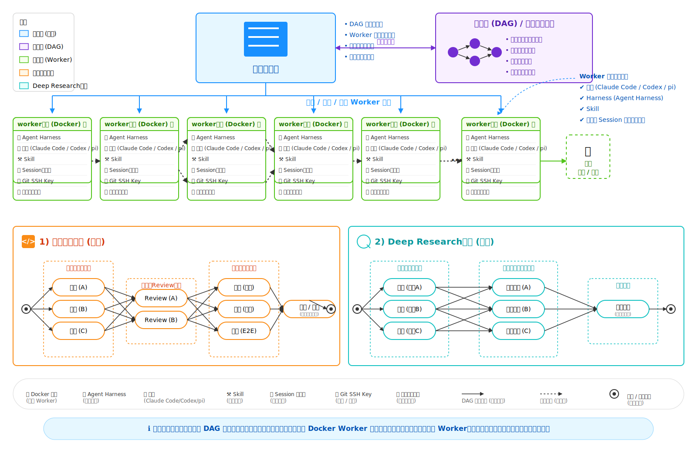

# Beehive — 架构设计文档

> 版本: v1.0 | 创建: 2026-05-12

---

## 架构全景

```
┌──────────────────────────────────────────────────────────────────────────┐
│                         主控层 (Brain — 编排)                             │
│  ┌─────────────────────┐                                                │
│  │    🐝 主控服务器      │                                                │
│  │                     │    · DAG 调度与编排                              │
│  │   ┌───────────────┐ │    · Worker 生命周期管理                          │
│  │   │  Coordinator  │ │    · 状态追踪与重试                              │
│  │   │  (beehive)    │ │    · 日志与指标监控                              │
│  │   └───────────────┘ │                                                │
│  └────────┬────────────┘                                                │
│           │ 创建 / 调度 / 监控 Worker 节点                                 │
└───────────┼────────────────────────────────────────────────────────────┘
            │
    ┌───────┼───────────────────────────────────────────────┐
    │       ▼                                               │
    │  ┌──────────────────────────────────────┐             │
    │  │     定义层 (DAG — 任务图)              │  ◄── 双向   │
    │  │                                      │             │
    │  │  · 任务节点与依赖关系                   │             │
    │  │  · 并行分支与汇聚                      │             │
    │  │  · 失败重试策略                        │             │
    │  │  · 资源与配置信息                      │             │
    │  └──────────────────────────────────────┘             │
    └───────────────────────────────────────────────────────┘
            │
            ▼
┌──────────────────────────────────────────────────────────────────────────┐
│                      执行层 (Hands — Worker 节点)                         │
│                                                                          │
│  ┌───────────┐  ┌───────────┐  ┌───────────┐  ┌───────────┐              │
│  │  Worker 1  │  │  Worker 2  │  │  Worker 3  │  │  Worker N  │  ...      │
│  │            │  │            │  │            │  │            │              │
│  │ 🐳 沙箱    │  │ 🐳 沙箱    │  │ 🐳 沙箱    │  │ 🐳 沙箱    │              │
│  │ 🤖 Harness│  │ 🤖 Harness│  │ 🤖 Harness│  │ 🤖 Harness│              │
│  │ 🧠 模型    │  │ 🧠 模型    │  │ 🧠 模型    │  │ 🧠 模型    │              │
│  │ ⚒️ Skill  │  │ ⚒️ Skill  │  │ ⚒️ Skill  │  │ ⚒️ Skill  │              │
│  │ 🕒 Session│  │ 🕒 Session│  │ 🕒 Session│  │ 🕒 Session│              │
│  │ 🔑 SSH Key│  │ 🔑 SSH Key│  │ 🔑 SSH Key│  │ 🔑 SSH Key│              │
│  │ 📁 工作目录│  │ 📁 工作目录│  │ 📁 工作目录│  │ 📁 工作目录│              │
│  └─────┬─────┘  └─────┬─────┘  └─────┬─────┘  └─────┬─────┘              │
│        │              │              │              │                     │
│        └──────┬───────┴──────┬───────┘──────┬───────┘                     │
│               │   DAG 依赖    │  并行分支     │                            │
│               ▼              ▼              ▼                            │
│                     🔄 随时销毁 / 重建                                     │
└──────────────────────────────────────────────────────────────────────────┘
```

### Worker 节点组成

| 组件 | 说明 |
|------|------|
| 🐳 沙箱 | Docker 容器 或 CubeSandbox KVM MicroVM |
| 🤖 Agent Harness | 执行框架 (cc-connect agent / Task) |
| 🧠 模型 | Claude Code / Codex / 可配置 |
| ⚒️ Skill | 从 workers/*.yaml 加载的技能定义 |
| 🕒 Session 恢复点 | 从 store/sessions/ 事件日志恢复 |
| 🔑 Git SSH Key | 模板注入，不进沙箱 (安全内置) |
| 📁 工作目录 | 只读挂载项目代码与数据 |

### 设计原则

| # | 原则 | 来源 |
|---|------|------|
| 1 | 接口稳定，实现可变 | Anthropic |
| 2 | 文件即记忆 | skillssss |
| 3 | 隔离即规范 | skillssss |
| 4 | Cattle, not Pets — Worker 随时销毁/重建 | Anthropic |
| 5 | 按需供应 — 沙箱仅在 Execute 时创建 | Anthropic |
| 6 | 安全内置 — Token 不进入沙箱 | CubeSandbox |
| 7 | 纠错闭环 — Dev→Review→Fix 最多 3 轮 | skillssss |
| 8 | 快照回滚 — 修正失败可回滚 | CubeSandbox |

---

## 模块设计

### 目录结构

```
Beehive/
├── cmd/beehive/main.go       # CLI 入口 (start/run/worker/status/serve)
├── internal/
│   ├── task/                 # 任务模型 + DAG 拆解器
│   │   ├── model.go          #   Task, SubTask, Context, Status
│   │   └── decomposer.go     #   按 type 拆解 DAG
│   ├── session/              # Session 事件日志
│   │   └── session.go        #   Session, Event, Append, GetEvents
│   ├── executor/             # Execute 接口与多实现
│   │   ├── executor.go       #   Executor 接口定义
│   │   ├── subagent.go       #   SubAgentExecutor (cc-connect)
│   │   ├── cubesandbox.go    #   CubeSandboxExecutor (KVM, 远期)
│   │   └── local.go          #   LocalExecutor
│   ├── registry/             # Agent Registry
│   │   └── registry.go       #   Agent ID 记录与查询
│   ├── review/               # 审查报告
│   │   └── review.go         #   ReviewReport 模型
│   └── store/                # YAML 读写工具
│       └── store.go          #   MarshalYAML, UnmarshalYAML, WriteFile
├── workers/                  # Worker Skill 定义 (Dev + Reviewer 成对)
├── tasks/                    # 用户丢任务 .yaml 文件
└── store/                    # 运行时数据
    ├── sessions/             #   Session 事件日志 (.jsonl)
    ├── agents/               #   Agent Registry (.json)
    ├── results/              #   执行产出物
    └── knowledge/            #   lessons-learned.md + main-log.md
```

### 模块职责

| 模块 | 职责 | 依赖 |
|------|------|------|
| `cmd/beehive` | CLI 入口，命令分发 | 所有 internal 模块 |
| `task` | 任务模型定义 + DAG 拆解策略 | store |
| `session` | 事件日志存储与查询 | 文件系统 |
| `executor` | Execute 接口 + 三种实现 | session, registry, review, workers |
| `registry` | Agent ID 持久化 | 文件系统 |
| `review` | 审查报告模型 | store |
| `store` | YAML 序列化/反序列化工具 | gopkg.in/yaml.v3 |

---

## 数据模型

```go
// Task — 用户提交的顶层任务
type Task struct {
    ID          string    `yaml:"id"`
    Name        string    `yaml:"name"`
    Type        string    `yaml:"type"`       // feature / bugfix / refactor / research
    Description string    `yaml:"description"`
    ProjectPath string    `yaml:"project_path,omitempty"`
    Branch      string    `yaml:"branch,omitempty"`
    MaxRetries  int       `yaml:"max_retries,omitempty"`  // 默认 3
    TimeoutSecs int       `yaml:"timeout_secs,omitempty"` // 默认 300
    CreatedAt   time.Time `yaml:"created_at"`
    SubTaskIDs  []string  `yaml:"subtask_ids,omitempty"`
    Status      Status    `yaml:"status"`
}

// SubTask — DAG 中的一个执行节点
type SubTask struct {
    ID          string    `yaml:"id"`
    ParentID    string    `yaml:"parent_id"`
    Seq         int       `yaml:"seq"`
    Type        string    `yaml:"type"`         // code / review / research / test
    Worker      string    `yaml:"worker"`       // 对应 workers/*.yaml 中的 name
    Prompt      string    `yaml:"prompt"`
    DependsOn   []string  `yaml:"depends_on"`   // 前置依赖子任务 ID 列表
    Status      Status    `yaml:"status"`
    MaxRetries  int       `yaml:"max_retries"`
    RetryCount  int       `yaml:"retry_count"`
    TimeoutSecs int       `yaml:"timeout_secs"`
    Context     Context   `yaml:"context"`
    ResultFile  string    `yaml:"result_file,omitempty"`
    CreatedAt   time.Time `yaml:"created_at"`
    StartedAt   time.Time `yaml:"started_at,omitempty"`
    FinishedAt  time.Time `yaml:"finished_at,omitempty"`
    Error       string    `yaml:"error,omitempty"`
}

type Status string
const (
    StatusPending Status = "pending"
    StatusRunning Status = "running"
    StatusDone    Status = "done"
    StatusFailed  Status = "failed"
)

type Context struct {
    TaskDescription string            `yaml:"task_description"`
    ProjectPath     string            `yaml:"project_path,omitempty"`
    Branch          string            `yaml:"branch,omitempty"`
    Extra           map[string]string `yaml:"extra,omitempty"`
}

// Session Event — 事件日志条目
type Event struct {
    Seq       int       `json:"seq"`
    Timestamp time.Time `json:"timestamp"`
    Type      string    `json:"type"`
    SubTaskID string    `json:"subtask_id,omitempty"`
    Data      string    `json:"data,omitempty"`
    Error     string    `json:"error,omitempty"`
}

// ReviewReport — 审查报告
type ReviewReport struct {
    Module      string    `json:"module"`
    Dimension   string    `json:"dimension"`
    Round       int       `json:"round"`
    Verdict     string    `json:"verdict"`       // PASS / FAIL
    MaxSeverity string    `json:"max_severity"`  // blocker / major / minor / null
    Failures    []Failure `json:"failures"`
}

type Failure struct {
    Severity   string `json:"severity"`   // blocker / major / minor
    Category   string `json:"category"`
    File       string `json:"file"`
    Line       int    `json:"line"`
    Reason     string `json:"reason"`
    Suggestion string `json:"suggestion"`
}

// WorkerDef — Worker Skill 定义
type WorkerDef struct {
    Name        string        `yaml:"name"`
    Description string        `yaml:"description"`
    Model       string        `yaml:"model"`       // inherit / claude-sonnet / custom
    Tools       []string      `yaml:"tools"`
    Sandbox     SandboxConfig `yaml:"sandbox,omitempty"`
    Reviewer    string        `yaml:"reviewer"`    // 配对 Reviewer Worker 名
    Prompt      string        `yaml:"prompt"`
}

type SandboxConfig struct {
    Type    string `yaml:"type"`    // cubesandbox / docker / local
    Image   string `yaml:"image"`
    CPU     string `yaml:"cpu"`
    Memory  string `yaml:"memory"`
    Timeout int    `yaml:"timeout"`
}
```

---

## 核心接口

```go
// Executor — Hands 层统一抽象。接口稳定，实现可变。
type Executor interface {
    Execute(ctx context.Context, worker WorkerDef, prompt string) (*Result, error)
}

type Result struct {
    Output   string
    Files    []string
    Error    string
    Duration time.Duration
}

// 三种实现:
//   SubAgentExecutor     — cc-connect Agent (开发/调试)
//   CubeSandboxExecutor  — KVM MicroVM 硬件隔离 (生产)
//   LocalExecutor        — 直接本地执行 (简单任务)

// SessionStore — 事件日志持久化
type SessionStore interface {
    Create(taskID string) (string, error)
    Append(sessionID string, event Event) error
    GetEvents(sessionID string, fromSeq int) ([]Event, error)
    DeriveStatus(sessionID string) (*TaskStatus, error)
}

// AgentRegistry — Agent ID 管理 (用于修正时 resume)
type AgentRegistry interface {
    Register(key string, agentID string, agentType string) error
    GetID(key string) (string, error)
    Remove(key string) error
}
```

---

## 执行流水线

### 主流程

```
用户丢 task.yaml
  → Coordinator (3s 轮询) 检测新 YAML
  → Decomposer 按 type 拆解 DAG
  → Session AppendEvent (task_decomposed + subtask_dispatched)
  → Executor 扫描就绪子任务 (依赖满足)
  → 单子任务流水线:
      1. AppendEvent(execution_started) + MarkRunning
      2. Execute(Dev Agent) → 执行
      3. Execute(Reviewer Agent) → 审查 → test-report.json
      4. PASS → MarkDone, AppendEvent(subtask_done)
         FAIL → 进入修正循环 (最多3轮)
  → lessons-learned.md 更新 + main-log.md 记录
```

### 状态机

```
pending → (deps全部done) → running → done
                            ↓
                      failed / timeout
                            ↓
                   retry_count < max → pending (重试)
                   retry_count >= max → failed (final)
```

### 任务类型与 DAG

| type | DAG 流程 | 并行 |
|------|---------|------|
| `feature` | 分析 → 编码(并行) → Review(并行) → 测试(并行) → 合并 | 编码/Review/测试 内部并行 |
| `bugfix` | 诊断 → 修复 → 验证 | 否 |
| `refactor` | 方案 → 重构 → 验证 | 否 |
| `research` | 搜索(并行) → 写作(并行) → 汇总 | 搜索/写作 内部并行 |
| 其他 | 执行 → 检查 | 否 |

---

## Session 事件日志

### 事件类型

| 事件类型 | 触发时机 |
|----------|---------|
| `task_detected` | Coordinator 发现新 YAML |
| `task_decomposed` | Decomposer 完成拆解 |
| `subtask_dispatched` | 子任务就绪 |
| `execution_started` | Worker 开始执行 |
| `execution_completed` | Worker 执行完成 |
| `review_passed` | Reviewer 判定 PASS |
| `review_failed` | Reviewer 判定 FAIL |
| `fix_applied` | Dev Agent 完成修复 |
| `subtask_done` | 子任务最终完成 |
| `subtask_failed` | 子任务最终失败 |
| `subtask_timeout` | 子任务超时 |

### 存储格式

```
store/sessions/{sessionID}.jsonl  (append-only)

{"seq":1,"timestamp":"...","type":"task_detected","data":"..."}
{"seq":2,"timestamp":"...","type":"task_decomposed","data":"..."}
...
```

---

## Worker Skill 定义规范

### Dev Worker

```yaml
name: coder
description: "代码实现 — 按方案写代码，支持修正模式"
model: inherit
tools: [terminal, file, web]
sandbox:
  type: cubesandbox
  image: sandbox-code:latest
  cpu: "2"
  memory: "4G"
  timeout: 300
reviewer: coder-reviewer

prompt: |
  ## 开发模式
  1. 读取 Subtask Prompt + 前置依赖文件
  2. 编写代码
  3. 输出到 store/results/{subtask_id}-output.md

  ## 修正模式 (resume)
  1. 读取审查报告
  2. 一次性修正所有问题
  3. 更新 lessons-learned.md
```

### Reviewer Worker

```yaml
name: coder-reviewer
description: "代码审查 — 只读，绝不修改代码"
model: inherit
tools: [file]  # 只读

prompt: |
  审查维度: 逻辑正确性 / 边界条件 / 代码风格 / 是否偏离方案

  JSON 报告格式:
  {
    "verdict": "PASS|FAIL",
    "max_severity": "blocker|major|minor|null",
    "failures": [{"severity":"...","file":"...","line":0,"reason":"...","suggestion":"..."}]
  }
```

---

## 纠错闭环

### 修正循环 (最多 3 轮)

```
Round 1: Dev执行 → Review → PASS? → ✅ done
                                ↓ FAIL
Round 2: resume Dev ← 审查报告 → 修复 → Review → PASS? → ✅ done
                                                    ↓ FAIL
Round 3: resume Dev ← 审查报告 → 修复 → Review → PASS? → ✅ done
                                                    ↓ FAIL
                                          ┌─────────┴─────────┐
                                     blocker/major        only minor
                                          ↓                   ↓
                                     ❌ failed           ⚠️ 降级通过
```

### Agent Resume 机制

```
1. Dev Agent 启动 → Agent ID → store/agents/{worker_key}.json
2. Review FAIL → Coordinator 读取 ID
3. Task(task_id: "{ID}", subagent_type: "general", prompt: "修正...")
4. 修复完成 → 更新 store/agents/{worker_key}.json
```

---

## 安全模型

```
沙箱外部 (Vault/MCP)          沙箱内部 (Agent 可触及)
─────────────────────         ─────────────────────
Git Token (原始)       ──→    Git Remote Config (嵌入)
API Key (Vault)        ──→    代理调用 (不接触 Key)
SSH Private Key        ──→    只读挂载 (无法读取)
用户凭据               ──→    ❌ 永不可达
```

| 层级 | 机制 | 防护 |
|------|------|------|
| 硬件 | KVM MicroVM (CubeSandbox) | 独立 Guest OS 内核 |
| 网络 | eBPF (CubeVS) | 沙箱间隔离 + 出站过滤 |
| 内存 | CoW 写时复制 | 内存复用 + 隔离 |
| 进程 | 独立 PID namespace | 无法窥探宿主机 |

---

## 部署架构

### 单节点

```
┌─────────────────────────────────────────┐
│  beehive start / worker                 │
│        │                                │
│        ▼                                │
│  CubeSandbox KVM MicroVM               │
│  Worker × N (<5MB/实例, 1000+/节点)      │
│                                         │
│  store/   tasks/   workers/            │
└─────────────────────────────────────────┘
```

### 集群 (远期)

```
API 网关 → CubeMaster+Beehive × N → Cubelet → Worker × N
```

---

## Hermes 集成

### 概述

Hermes 是 cc-connect 的定时任务调度系统，负责按周期触发子任务执行。Beehive 提供两种执行模式：

| 模式 | 实现 | 适用场景 |
|------|------|---------|
| **内置循环** | `beehive worker` (Go 进程内 while 循环) | 单节点持续运行 |
| **Hermes 调度** | cc-connect cron 定时调用 `beehive run` | 分布式/多节点调度、精确时间控制 |

### 角色边界

```
Coordinator (beehive start)          Hermes (cc-connect cron)
────────────────────────────        ─────────────────────────
· 轮询 tasks/ 检测新任务              · 定时触发执行命令
· 拆解 DAG 子任务                    · 管理调度策略 (cron/interval)
· 管理 Session 事件日志              · 监控执行状态
· 超时检测与重试决策                  · 失败通知

               │                              │
               └──────────┬───────────────────┘
                          │
                          ▼
                 ┌─────────────────┐
                 │  beehive run    │  ← 单次执行一个就绪子任务
                 │  Dev→Review→Fix │
                 └─────────────────┘
```

### 使用方式

**方案 A: 内置循环 (beehive worker)**

```bash
# 终端1: Coordinator
./bin/beehive start

# 终端2: Worker 持续循环 (每5秒扫描一次 pending)
./bin/beehive worker
```

`beehive worker` 等价于 `while true; do ./bin/beehive run; sleep 5; done`。

**方案 B: Hermes cron 调度**

```bash
# 每30秒触发一次执行
cc-connect cron add --cron "*/1 * * * *" \
  --exec "cd ~/code/Beehive && ./bin/beehive run" \
  --desc "Beehive Worker 调度" \
  --session-mode new-per-run
```

也可以通过 prompt 模式调度：

```bash
cc-connect cron add --cron "*/1 * * * *" \
  --prompt "切换到 ~/code/Beehive 目录，执行 ./bin/beehive run 命令完成一个就绪子任务。" \
  --desc "Beehive Worker 任务执行" \
  --session-mode new-per-run
```

### 调度策略建议

| 场景 | 推荐模式 | 间隔 | 理由 |
|------|---------|------|------|
| 开发调试 | 手动 `beehive run` | — | 需要观察每步结果 |
| 单机持续运行 | `beehive worker` | 5s | 最低延迟，零外部依赖 |
| 多任务并行 | Hermes cron × N | 30s × N | 多进程并发执行不同子任务 |
| 精确定时 | Hermes cron | 按需 | 支持标准 cron 表达式 |

### Hermes 与 Coordinator 的 Session 交互

```
Hermes cron 触发 beehive run
  │
  ▼
beehive run 读取 Session 事件日志 → 找到就绪子任务
  │
  ▼
执行 Dev→Review→Fix 流水线 → 写入 Session 事件
  │
  ▼
beehive run 退出 (单次执行)
  │
  ▼
Hermes 下次触发时，从 Session 事件推导最新状态，继续执行
```

关键点: **Session 外置**使得 Hermes 每次调用的 `beehive run` 都从持久化的事件日志中获取最新状态，无需进程间通信。

---

## 参考资料

### 架构设计参考图



**图层说明：**

| 图层 | 颜色 | 职责 |
|------|------|------|
| 主控层 | 蓝 | DAG 调度与编排、Worker 生命周期管理、状态追踪与重试、日志与指标监控 |
| 定义层 | 紫 | 任务节点与依赖关系、并行分支与汇聚、失败重试策略、资源与配置信息 |
| 执行层 | 绿 | Docker/CubeSandbox Worker 节点，可随时销毁/重建 |

**Worker 内部组成：** 🐳沙箱 · 🤖Agent Harness · 🧠模型(Claude Code/Codex/pi) · ⚒️Skill · 🕒Session恢复点 · 🔑Git SSH Key · 📁工作目录

**两个示例流程：**
- **软件研发流程** — Start → 并行编码(A/B/C) → 并行Review(A/B) → 并行测试(单元/集成/E2E) → 汇总合并 → End
- **Deep Research流程** — Start → 并行搜索(主题A/B/C) → 并行写作整理(A/B/C) → 研究报告 → End

---

### Anthropic Managed Agents

> 来源: https://www.anthropic.com/engineering/managed-agents

**核心设计理念：**

| 理念 | 说明 | Beehive 采纳 |
|------|------|-------------|
| **Brain-Hands-Session 三元解耦** | 编排、执行、会话三个独立接口 | 主控层/执行层/Session事件日志 三层架构 |
| **接口稳定，实现可变** | 对接口形状有意见，对背后实现不设限 | `Execute(ctx, worker, prompt) → Result` 接口，三种实现可替换 |
| **Execute 统一接口** | `execute(name, input) → string` | 解耦 Brain 与 Hands |
| **Session ≠ Context Window** | Session 是上下文窗口之外的持久化事件日志 | `store/sessions/{id}.jsonl` append-only |
| **Cattle, not Pets** | 所有组件可丢弃重建 | Worker 随时销毁/重建，崩溃可恢复 |
| **安全边界内置** | Token 永不进入沙箱 | Git Key 模板注入，不进沙箱 |
| **按需供应** | 沙箱仅在工具调用时创建 | CubeSandbox 按需创建，<60ms 冷启动 |
| **多脑多手** | 一个大脑可连多只手 | Worker 节点无状态，可任意调度 |
| **Harness 假设会过时** | 需构建不依赖模型特定假设的元系统 | Beehive 是 meta-harness |

**原文关键段落：**

> "We're opinionated about the shape of these interfaces, not about what runs behind them."

> "Harnesses encode assumptions that go stale as models improve."

> "The token is never reachable from the sandbox."

---

### CubeSandbox

> 来源: https://github.com/TencentCloud/CubeSandbox

腾讯云开源的高性能安全沙箱服务，专为 AI Agent 设计。基于 RustVMM 和 KVM，Apache 2.0 许可证。

**性能指标：**

| 指标 | 数值 |
|------|------|
| 冷启动时间 | < 60ms (端到端) |
| 内存开销 | < 5MB / 实例 |
| 单节点密度 | 数千个 Agent |
| 50 并发 P95 延迟 | 90ms |
| E2B SDK 兼容 | 即插即用，换 URL 即可 |

**架构组件：**

| 组件 | 职责 |
|------|------|
| CubeHypervisor | KVM MicroVM 管理 |
| CubeShim | containerd Shim v2，容器运行时集成 |
| CubeVS | eBPF 虚拟交换机，内核级网络隔离 |
| CubeAPI | REST API 网关 (Rust)，兼容 E2B 协议 |
| CubeMaster | 集群编排器，资源调度 |
| Cubelet | 节点本地沙箱生命周期管理 |
| CubeProxy | E2B 协议反向代理 |

**核心能力：**
- KVM 硬件级虚拟化，独立 Guest OS 内核，消除容器逃逸风险
- 资源池预置 + CoW 快照克隆，实现极速冷启动
- eBPF 网络隔离 + 细粒度出站流量过滤
- 毫秒级快照回滚 (即将推出)

**使用方式：**
```python
from e2b_code_interpreter import Sandbox
with Sandbox.create(template=os.environ["CUBE_TEMPLATE_ID"]) as sandbox:
    result = sandbox.run_code("print('Hello from Cube Sandbox!')")
```

---

### skillssss — 多智能体协同开发方法论

> 来源: `/home/user/code/skillssss/`

基于 AI Agent 的多智能体协同开发框架，通过 1 个架构设计模块 + 4 个领域开发模块 + 1 个部署模块共 27 个子智能体协作，实现从 PRD 到生产部署的全流程自动化研发。

**三条铁律：**

| 铁律 | 含义 | Beehive 采纳 |
|------|------|-------------|
| **文件即记忆** | 子智能体产出必须持久化到文件 | store/results/ + Session 事件日志 |
| **隔离即规范** | 子智能体只看到主智能体给的信息 | Worker 只接收 SubTask.Prompt + Context |
| **记录即保险** | 所有 Agent 写日志，确保可追溯 | main-log.md + lessons-learned.md |

**三角色模型：**

```
┌─────────────┐
│   主智能体    │  编排者：拆任务、管状态、中转信息
└──────┬──────┘
       │
   ┌───┴───────────┐
   ▼               ▼
┌──────────┐  ┌──────────┐
│ 开发智能体 │  │ 测试智能体 │  ← 测试只读，绝不修改代码
└──────────┘  └──────────┘
```

**纠错循环：**
- 开发 → 三维测试(功能/性能/安全) → FAIL → resume 同一 Agent 修复 → 重测，最多 3 轮
- Agent ID 通过 `agent-registry/` 目录追踪

**经验库设计：**
1. 原则性 > 数值性 (写"为什么错"而非"改了什么值")
2. 模式级 > 页面级 (写"哪种业务场景容易犯这个错")
3. 可迁移 > 可复制 (下个项目还能用吗？)

**v2 改进项对照：**

| v1 问题 | v2 解决方案 | Beehive 采纳 |
|---------|-----------|-------------|
| Agent ID 依赖时间戳 | agent-registry/{key}.json | store/agents/{key}.json |
| 判定依赖文本匹配 | 结构化 test-report.json | ReviewReport JSON |
| 3轮无差异 | severity 三级 | blocker/major/minor |
| 无回滚路径 | git revert + 重启 | CubeSandbox 快照回滚 |
| 无成本追踪 | 记录调用次数和 token | main-log.md 成本追踪 |

---

### 设计融合

```
Anthropic Managed Agents          skillssss/harness           CubeSandbox
─────────────────────────        ──────────────────         ──────────────
Brain-Hands-Session 解耦         主-从协同 三角色模型         KVM MicroVM 沙箱
Execute 统一接口                  Dev→Review→Fix 纠错闭环     <60ms 冷启动
Cattle, not Pets                 文件即记忆 · 隔离即规范      <5MB 内存
Session 事件日志                  Agent Registry             eBPF 网络隔离
安全边界内置                      lessons-learned             E2B SDK 兼容
按需供应                         结构化 test-report.json      快照回滚
                                 3轮修正 + 降级通过
        │                              │                         │
        └──────────────────────────────┼─────────────────────────┘
                                       │
                                       ▼
                              ┌─────────────────┐
                              │   🐝 Beehive    │
                              │  智能体蜂群框架   │
                              └─────────────────┘
```
